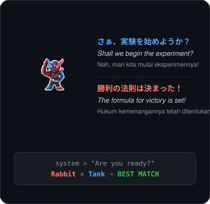
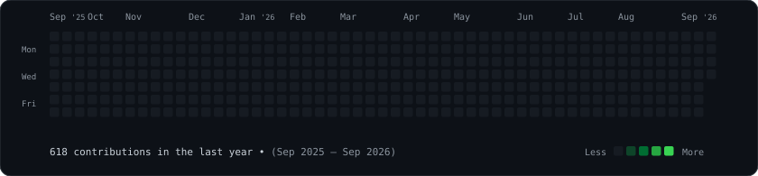

<!-- DUAL TERMINAL CARDS -->

  

<!-- TELEMETRY SOURCES STATUS BAR -->

  <code>GH: Azvi27</code> &nbsp;•&nbsp;
  <code>GL Cloud: gitlab.azvibelajar.my.id</code> &nbsp;•&nbsp;
  <code>Lab 1: Lab. SSTK 1</code> &nbsp;•&nbsp;
  <code>Lab 2: Lab. SSTK 2</code>

<!-- AGGREGATED HEATMAP -->

