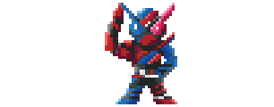

<div align="center">

<!-- 01. IDENTITY / PORTRAIT -->
<p><b>azvi@github ~ $ whoami</b></p>


<br><br>

<!-- 02. SYSTEM INFO (NEOFETCH) -->
<p><b>azvi@github ~ $ neofetch --profile</b></p>

<table>
  <tr>
    <td align="center" width="150" valign="middle">
      <br>
      <sub><i>"Saa, jikken o hajimeyou ka?"</i></sub>
    </td>
    <td valign="middle">
<pre>
OS: Engineering Physics @ UGM
Role: Full-Stack Dev & Embedded Instrumentation
Kernel: Applied Physics, IoT, Control Systems
Core: Go, Python, C/C++, Docker, SQL
Best Match: Physics (Rabbit) + Code (Tank)
Status: "Shouritsu no housoku wa kimatta!"
</pre>
    </td>
  </tr>
</table>

<br><br>

<!-- 03. MULTI-SERVER CONTRIBUTIONS -->
<p><b>azvi@github ~ $ ./contributions.sh --status</b></p>

```text
[✓] GitHub Core (Azvi27)
[✓] Cloud GitLab (gitlab.azvibelajar.my.id)
[✓] Lab On-Premise Node 1 (Lab. SSTK 1)
[✓] Lab On-Premise Node 2 (Lab. SSTK 2)
